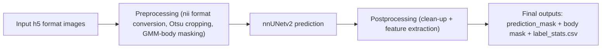

# FlySeg 🧬🍃

**FlySeg** is a pretrained, modular image segmentation pipeline tailored for *Drosophila* tissue segmentation using the [nnUNet v2](https://github.com/MIC-DKFZ/nnUNet) framework.  

It enables automated processing and segmentation of `.h5` 3D fluorescence imaging data for multiple target tissues, generating postprocessed `.nii.gz` segmentation masks and statistical outputs in a streamlined and reproducible workflow.  

---

## ✨ Features

- ✅ End-to-end nnUNet v2 inference pipeline  
- ✅ Automated preprocessing: `.h5 → .nii.gz` (Otsu thresholding + Gaussian smoothing + 3D masking)  
- ✅ Automatic environment setup and inference execution  
- ✅ Postprocessing with label cleanup and statistics  
- ✅ High-performance multi-threaded image processing  
- ✅ Command-line interface with flexible arguments  

---

## 📦 Installation

1. **Install via pip:**
```bash
pip install git+https://github.com/Chase-hucl/Flyseg.git
```

2. **(Optional) Install dependencies manually:**
```bash
pip install -r requirements.txt
```

---

## 🚀 Usage Example

```bash
python -m flyseg.prediction   --input "T:\Chenglang\classification\annotation\dataset\20250415\20250415\Control\Good images\test"   --output "T:\Chenglang\test"   --application Toxicology   --info PMMA_control   --date 20250415   --organ CNS
```

### Parameters
- `--input`: Input `.h5` file path  
- `--output`: Output directory  
- `--application`: Application type (e.g., Toxicology)  
- `--info`: Experiment batch info (e.g., PMMA_control)  
- `--date`: Experiment date (YYYYMMDD)  
- `--organ`: Target tissue segmentation, options:  
  - `CNS` — Central nervous system segmentation  
  - `Nubbin` — Nubbin region segmentation  

---

## 🔧 Maintenance & Cleanup

If the pretrained model or installed package becomes corrupted, outdated, or you need to free up space, run:  

```bash
flyseg-clean-model
```

This will remove the cached `pretrained_model/` folder.  

---

## 📂 Output Data Structure (Example)

```text
output_dir/
└── Toxicology/
    └── 20250419/
        └── PMMA_control/
            ├── Body_mask/                
            ├── imagesTs/                 
            ├── temporary/                
            ├── temporary_PP/             
            ├── prediction_mask/          
            ├── label_stats.csv           
            └── preprocessing_summary.csv 
```

---

## 💪 Full Uninstallation

To completely remove FlySeg and its cached model files:  

```bash
flyseg-clean-model   # or manually delete pretrained_model/
pip uninstall flyseg
```

```bash
python -m flyseg.prediction   --input "./test_data"   --output "./results"   --organ Nubbin
```

This will automatically run preprocessing, segmentation, and postprocessing, generating final masks and label statistics.  

### Pipeline Overview


---

## 📬 Contact
For questions or suggestions, please contact:  
Email: **huchenglang123@gmail.com**
